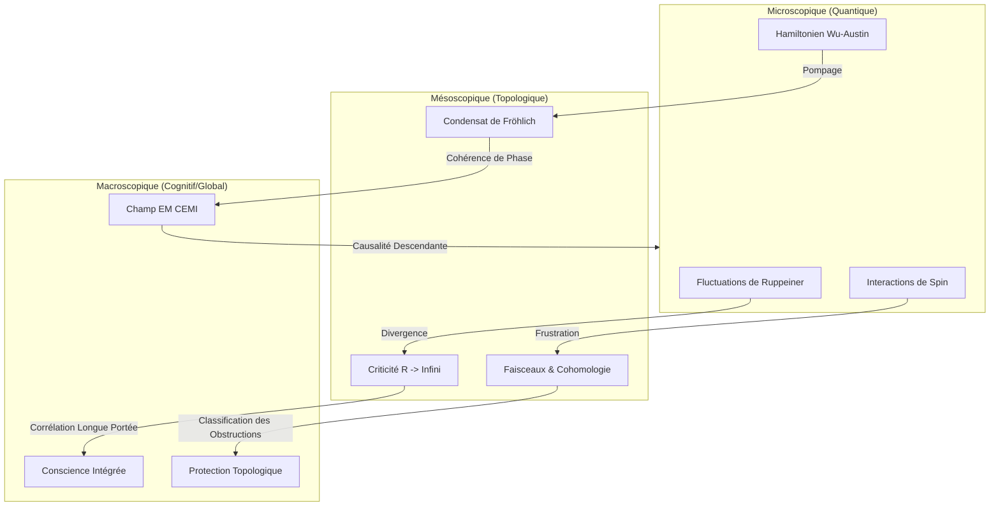

# STU-Framework : La Science de la Topologie Unifiée


> [cite_start]**"La réalité physique, informationnelle et cognitive est structurée par des invariants topologiques et géométriques globaux qui transcendent les lois de la thermodynamique locale."** — *Science de la Topologie Unifiée* [cite: 8, 9]

## 🌌 Synopsis

Le **STU-Framework** propose un changement de paradigme fondamental : le passage du réductionnisme énergétique à une compréhension morphologique de l'univers. En synthétisant la matière condensée, la géométrie de l'information et la neuroscience, ce dépôt formalise comment la **forme** (Topologie) dicte la **force** et la fonction.

Ce projet explore quatre axes majeurs :
1.  **L'Unification par la Courbure** (Géométrie de Fisher-Ruppeiner).
2.  **La Cohomologie de l'Impossible** (Théorie des Faisceaux & Frustration).
3.  **Les Champs de Conscience** (Condensation de Fröhlich & CEMI).
4.  **La Robustesse Topologique** (Isolants Topologiques & Effet Aharonov-Bohm).

---

## 📐 Formalisme Mathématique

### 1. La Métrique de Fisher-Ruppeiner
La distance entre deux états thermodynamiques est définie par la probabilité qu'une fluctuation thermique les connecte. [cite_start]L'élément de longueur est dérivé du Hessien de l'entropie[cite: 24, 26]:

$$
dl^{2} = g_{\mu\nu}dX^{\mu}dX^{\nu} = -\frac{\partial^{2}S}{\partial X^{\mu}\partial X^{\nu}}dX^{\mu}dX^{\nu}
$$

L'invariant central, la courbure scalaire $R$, mesure l'intensité de l'interaction. [cite_start]Près d'un point critique (transition de phase), la courbure diverge selon la longueur de corrélation $\xi$ et la dimension spatiale $d$[cite: 40]:

$$
|R| \sim \xi^{d} \rightarrow \infty
$$

### 2. La Cohomologie de la Frustration
La frustration (l'impossibilité de satisfaire localement toutes les contraintes) est formellement définie comme une obstruction topologique. [cite_start]Pour un réseau de spins, le critère de Toulouse sur une boucle fermée est[cite: 87]:

$$
P = \prod_{boucle} sign(J_{ij}) < 0
$$

[cite_start]Dans le langage de la théorie des faisceaux, cette obstruction correspond à une classe non triviale dans le premier groupe de cohomologie[cite: 108]:

$$
H^{1}(X, \mathbb{Z}_{2}) \neq 0
$$

### 3. Hamiltonien de Wu-Austin (Biologie Quantique)
[cite_start]La modélisation des microtubules et de la condensation de Fröhlich repose sur le Hamiltonien suivant, décrivant le couplage entre oscillateurs biologiques ($a_i$) et bain thermique ($b_k$)[cite: 132]:

$$
H = \sum_{i}\hbar\omega_{i}a_{i}^{\dagger}a_{i} + \sum_{k}\hbar\Omega_{k}b_{k}^{\dagger}b_{k} + \sum_{i,k}\chi_{ik}a_{i}^{\dagger}a_{i}(b_{k}^{\dagger}+b_{k})
$$

---

## 🧠 Architecture Conceptuelle



---

## 📊 Métrologie & Prédictions

Le cadre STU classifie les systèmes selon le signe de leur courbure thermodynamique  :

| Système | Signe de  | Type d'Interaction | Comportement Critique |
| --- | --- | --- | --- |
| **Gaz Idéal** |  | Aucune (Plat) | Pas de transition |
| **Fluide Van der Waals** |  | Attractive (Condensation) |  à  |
| **Trou Noir RN-AdS** |  | Gravité (Holographique) | Isomorphe au fluide VdW |
| **Fermions / Pauli** |  | Répulsive | Sphérique |
| **Réseaux de Neurones** |  | **Critique** | Maximisation de l'Information |

**La Conjecture Unifiée :**

> "Une transition de phase (divergence de ) est le mécanisme dynamique par lequel un système complexe modifie sa classe de cohomologie (), résolvant ou créant des obstructions topologiques pour s'adapter à son environnement." 
> 
> 

---

## 🚀 Roadmap des Applications

* **Court Terme :** Validation algorithmique de la "k-consistance" dans les réseaux de neurones via l'analyse cohomologique.
* **Moyen Terme :** Développement d'IA Topologiques (Sheaf Neural Networks) capables de raisonnement sémantique complexe et de détection d'incohérences logiques (résolution de ).
* **Long Terme :** Conception de matériel bio-inspiré exploitant la protection topologique pour le calcul sans dissipation à température ambiante.

## 🔗 Références

Basé sur les travaux de Bryan Ouellette : *La Géométrisation de la Complexité : Vers une Science Unifiée de la Topologie*.

```
